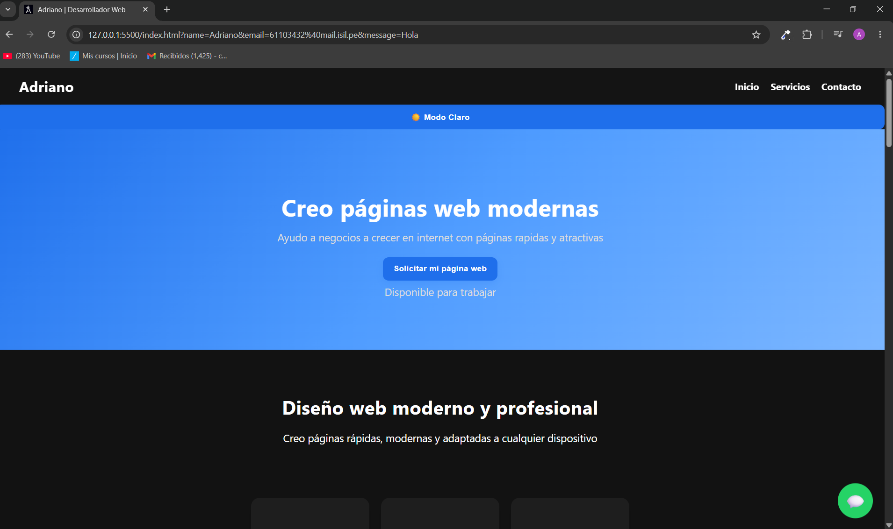

# 🚀 Portfolio Web - Adriano

## 👨‍💻 Desarrollador Web en formación

Proyecto creado con HTML, CSS y JavaScript.

Página moderna con:
- 🎨 Diseño responsive
- 🌙 Dark Mode
- ✨ Animaciones
- 📩 Formulario con EmailJS
- 🐉 API de Pokémon
- 💾 LocalStorage

---

# 🛠️ Tecnologías usadas

- HTML5
- CSS3
- JavaScript
- EmailJS
- GitHub Pages

---

# 📸 Captura del proyecto

---

# 🌐 Demo del proyecto

https://adriano27x.github.io/aprendizaje-web/

---

# 📌 Autor

Adriano